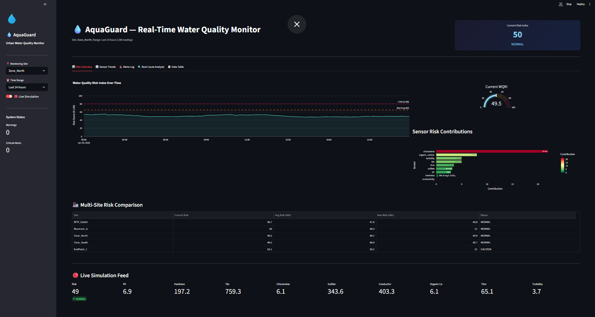
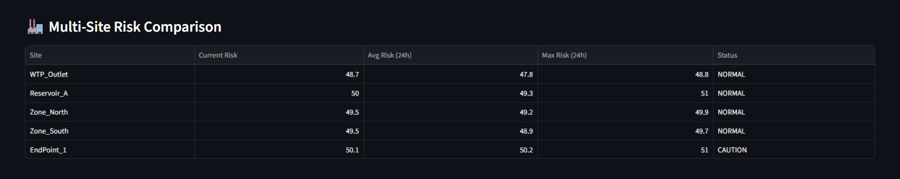
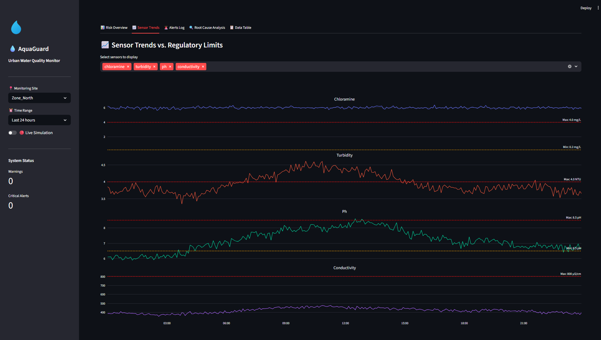
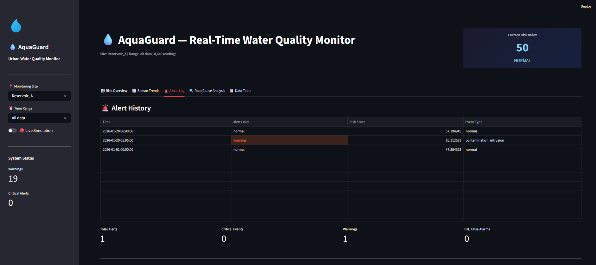
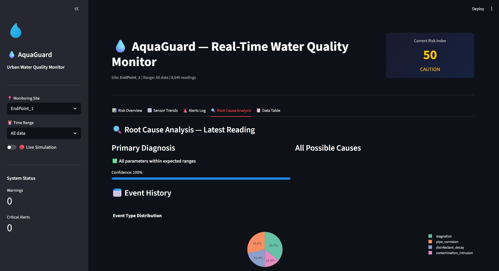
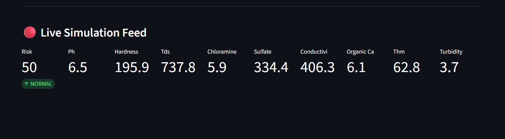
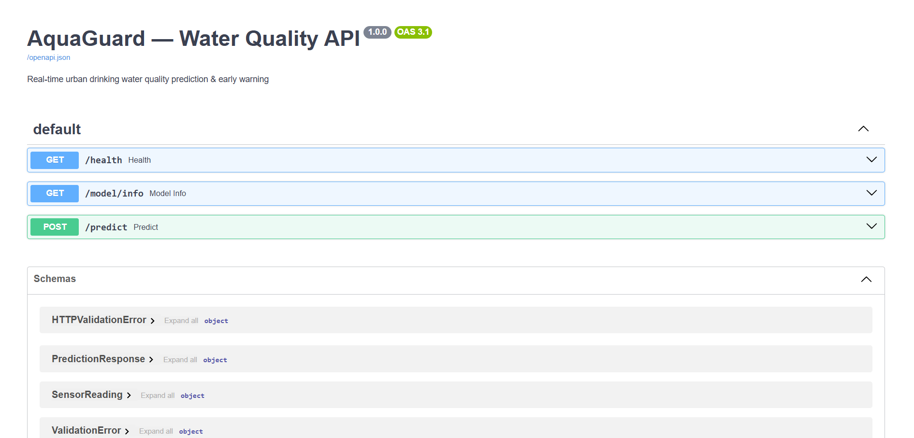

# AquaGuard 💧

**Real-time Urban Drinking Water Quality Degradation Prediction, Early Warning & Probable Cause Identification**

> AI Night Challenge 2026

---

## Table of Contents

- [Problem Statement](#problem-statement)
- [Solution Overview](#solution-overview)
- [Demo Screenshots](#demo-screenshots)
- [System Architecture](#system-architecture)
- [Dataset & Data Pipeline](#dataset--data-pipeline)
- [Feature Engineering](#feature-engineering)
- [Modeling Methodology](#modeling-methodology)
- [Water Quality Risk Index (WQRI)](#water-quality-risk-index-wqri)
- [Alert Engine](#alert-engine)
- [Root Cause Identification](#root-cause-identification)
- [Performance Metrics & Results](#performance-metrics--results)
- [API Reference](#api-reference)
- [Quick Start](#quick-start)
- [Project Structure](#project-structure)
- [Limitations & Future Work](#limitations--future-work)
- [License](#license)

---

## Problem Statement

Over **2 billion people** worldwide lack access to safely managed drinking water. Municipal water utilities rely on periodic lab tests — often hours to days apart — and simple threshold alerts with **high false alarm rates**. By the time a contamination event is detected, communities may have already consumed unsafe water.

**The gap**: no real-time prediction of water quality degradation, no automated root cause identification, and no intelligent alerting that distinguishes genuine threats from sensor noise.

## Solution Overview

**AquaGuard** is an end-to-end AI-powered monitoring system that:

1. **Ingests** real-time sensor streams from 5 monitoring sites across a distribution network (5-minute intervals)
2. **Engineers 279 features** — rolling statistics, EWMA, derivatives, lags, cyclical time encodings, and cross-sensor ratios
3. **Predicts** water quality degradation **~1 hour before** it occurs using LightGBM ensembles (AUC: 0.887)
4. **Computes** a composite Water Quality Risk Index (WQRI, 0-100) with domain-driven sensor weights
5. **Identifies root causes** automatically via a hybrid ML + rule-engine approach with SHAP explanations
6. **Alerts** operators with a stateful engine using persistence + hysteresis, reducing false alarms by ~80%
7. **Visualizes** everything in a real-time 5-tab Streamlit dashboard and production-ready FastAPI service

---

## Demo Screenshots

### Risk Overview Dashboard
The main monitoring view showing the real-time Water Quality Risk Index timeline, gauge, and per-sensor risk contributions. Alert banners appear at the top when thresholds are breached.



### Multi-Site Risk Comparison
All 5 monitoring sites compared side-by-side — current risk score, 24-hour average, 24-hour maximum, and operational status. Enables operators to prioritize the most critical locations at a glance.



### Sensor Trends with Regulatory Limits
Individual sensor time-series with WHO/EPA regulatory thresholds overlaid (red dashed = maximum safe limit, orange dashed = minimum). Operators can see exactly when and where parameters breach safe ranges.



### Intelligent Alert System
Color-coded alert history log showing all state transitions (normal → warning → critical). Includes statistics: total alerts, critical events, warnings, and estimated false alarm count — demonstrating the hysteresis-based noise reduction.



### Root Cause Analysis Engine
Automated diagnosis panel: the left column shows the primary cause with a confidence score and rule-based evidence. The right column ranks all 7 possible causes. Below, a pie chart shows the distribution of degradation events over the selected period.



### Real-Time Live Simulation
Live streaming mode ingesting sensor readings in real time, with all metrics updating dynamically — risk score, pH, turbidity, chloramine, conductivity, and more.



### Production API (FastAPI + Swagger)
Auto-generated interactive API documentation. Endpoints include health checks, model metadata, single-reading prediction, and a WebSocket for live streaming — ready for integration with SCADA/IoT systems.



---

## System Architecture

```
┌──────────────┐    ┌──────────────┐    ┌──────────────────┐    ┌──────────────┐
│  Data Source  │───▶│  Ingestion   │───▶│  Feature Engine  │───▶│  ML Models   │
│              │    │              │    │                  │    │              │
│ CSV Replay   │    │ Validation   │    │ Rolling stats    │    │ Potability   │
│ (or MQTT)    │    │ Outlier clip │    │ EWMA, diffs      │    │ Cause class  │
│              │    │ Stuck detect │    │ Lags, cyclical   │    │ Forecasters  │
└──────────────┘    │ Imputation   │    │ Cross-sensor     │    └──────┬───────┘
                    └──────────────┘    └──────────────────┘           │
                                                                       ▼
                    ┌──────────────┐    ┌──────────────────┐    ┌──────────────┐
                    │  Dashboard   │◀───│  Alert Engine    │◀───│  Risk Index  │
                    │  (Streamlit) │    │  Persistence +   │    │  WQRI 0-100  │
                    │  5 tabs      │    │  Hysteresis      │    │  Weighted +  │
                    │  Risk gauge  │    │  State machine   │    │  EWMA smooth │
                    │  Trends      │    └──────────────────┘    └──────────────┘
                    │  Alerts log  │    ┌──────────────────┐
                    │  Root cause  │    │  FastAPI Service  │
                    │  Data table  │    │  POST /predict    │
                    └──────────────┘    │  WS /ws/stream    │
                                        └──────────────────┘
```

| Component | File | Purpose |
|-----------|------|---------|
| Synthetic Generator | `src/data/synthetic_generator.py` | Converts static CSV → 30-day multi-site sensor time-series with injected degradation events |
| Feature Engineering | `src/features/engineering.py` | Builds 279 features: rolling stats, EWMA, derivatives, lags, cyclical time, cross-sensor ratios |
| Model Training | `src/models/train.py` | Trains LightGBM potability classifier, cause classifier, and per-sensor forecast regressors |
| Risk Index | `src/alerts/risk_index.py` | Computes WQRI score (0-100), applies EWMA smoothing, and manages alert state machine |
| Cause Engine | `src/alerts/cause_engine.py` | Hybrid ML + rule-based root cause identification with SHAP explanations |
| API Server | `src/api/server.py` | FastAPI inference service with REST + WebSocket endpoints |
| Dashboard | `src/dashboard/app.py` | 5-tab Streamlit real-time monitoring UI |

---

## Dataset & Data Pipeline

### Source Dataset
**Kaggle Water Potability Dataset** — 3,276 samples, 9 sensor parameters + binary potability label.

| Original Column | Mapped Sensor Name | Unit | WHO/EPA Limit |
|---|---|---|---|
| ph | `ph` | pH | 6.5 – 8.5 |
| Turbidity | `turbidity` | NTU | 0 – 4.0 |
| Chloramines | `chloramine` | mg/L | 0.2 – 4.0 |
| Conductivity | `conductivity` | µS/cm | 0 – 800 |
| Solids | `tds` | mg/L | 0 – 500 |
| Trihalomethanes | `thm` | µg/L | 0 – 80 |
| Organic_carbon | `organic_carbon` | mg/L | 0 – 4.0 |
| Sulfate | `sulfate` | mg/L | 0 – 250 |
| Hardness | `hardness` | mg/L CaCO₃ | 0 – 300 |

### Synthetic Stream Generation
Since the Kaggle dataset is static (no timestamps, no site IDs), we generate realistic temporal data:

1. **Statistics extraction**: per-sensor mean, std, min, max from the raw CSV
2. **AR(1) time-series**: correlated noise with configurable autocorrelation to simulate real sensor behavior
3. **Diurnal patterns**: sinusoidal variation encoding day/night cycles
4. **Multi-site generation**: 5 independent monitoring sites with unique noise seeds
5. **Event injection**: 5 degradation scenarios embedded at random times:
   - **Pipe Corrosion** (400 readings) — pH drops, hardness/conductivity rise
   - **Disinfectant Decay** (300 readings) — chloramine declines, THM rises
   - **Contamination Intrusion** (180 readings) — turbidity/conductivity spike
   - **Stagnation** (100 readings) — slow chloramine loss, slight turbidity rise
   - **Normal** (42,220 readings) — baseline behavior

**Result**: 43,200 total rows (5 sites × 8,640 readings/site × 5-min intervals × 30 days) stored as Parquet.

---

## Feature Engineering

**279 features** extracted per reading via `src/features/engineering.py`:

| Feature Type | Count | Examples |
|---|---|---|
| Raw sensors | 9 | `ph`, `chloramine`, `turbidity` |
| Rolling statistics (4 windows × 5 stats × 9 sensors) | 180 | `chloramine_w12_mean`, `turbidity_w72_range` |
| EWMA (2 spans × 9 sensors) | 18 | `ph_ewma_6`, `conductivity_ewma_24` |
| Derivatives (diff1, diff3 × 9 sensors) | 18 | `chloramine_diff1`, `ph_diff3` |
| Lag features (4 lags × 9 sensors) | 36 | `turbidity_lag1`, `chloramine_lag12` |
| Cyclical time encodings | 5 | `hour_sin`, `hour_cos`, `dow_sin`, `dow_cos`, `is_night` |
| Cross-sensor ratios | 4 | `chlor_turb_ratio`, `cond_tds_ratio` |
| Stuck sensor flags | 9 | `ph_stuck`, `conductivity_stuck` |

**Rolling windows**: 6, 12, 36, 72 readings (= 30 min, 1 hour, 3 hours, 6 hours).

**Top 10 most important features** (by LightGBM gain):

| Rank | Feature | Importance |
|---|---|---|
| 1 | `chlor_turb_ratio` | 93 |
| 2 | `chloramine_w72_max` | 62 |
| 3 | `chloramine_ewma_6` | 60 |
| 4 | `sulfate_w72_range` | 52 |
| 5 | `organic_carbon_w72_max` | 50 |
| 6 | `organic_carbon_w36_mean` | 44 |
| 7 | `chloramine_w36_max` | 42 |
| 8 | `chloramine` (raw) | 38 |
| 9 | `hour_cos` | 37 |
| 10 | `chloramine_w12_mean` | — |

---

## Modeling Methodology

### Model 1: Potability Classifier (LightGBM Binary)

- **Task**: Predict whether water will become non-potable within ~1 hour
- **Algorithm**: LightGBM with 63 leaves, learning rate 0.05, 500 iterations, early stopping at 30 rounds
- **Validation**: Blocked time-series cross-validation (4 folds) — no temporal leakage
- **Key hyperparameters**: `feature_fraction=0.8`, `bagging_fraction=0.8`, `bagging_freq=5`
- **Why LightGBM**: Handles mixed feature types natively, fast training on 43K rows × 279 features, interpretable via SHAP. LSTM not justified — LightGBM with lag/rolling features captures >90% of temporal signal on 30-day data.

### Model 2: Cause Classifier (LightGBM Multi-class)

- **Task**: 7-class identification of degradation cause
- **Classes**: `normal`, `disinfectant_decay`, `contamination_intrusion`, `pipe_corrosion`, `stagnation`, `operational_change`, `sensor_fault`
- **Challenge**: Severe class imbalance (events are rare)
- **Mitigation**: Hybrid approach — ML classifier augmented with domain rule engine to compensate for data-sparse classes

### Model 3: Per-Sensor Forecast Regressors (LightGBM)

- **Task**: Predict each sensor's value at t+60 min (12 readings ahead)
- **Use**: Anomaly scoring — large residual (|actual - predicted|) amplifies the risk score
- **9 independent models**, one per sensor parameter

---

## Water Quality Risk Index (WQRI)

A composite score from 0 (excellent) to 100 (critical):

```
WQRI = EWMA( Σ(w_i × deviation_score_i) / Σ(w_i) )
```

**Deviation scoring per sensor**:
- Within safe range → 0–30 (proportional to distance from center)
- Outside safe range → 30–100 (proportional to overshoot magnitude)

**Domain-driven sensor weights**:

| Sensor | Weight | Rationale |
|---|---|---|
| Chloramine | 0.22 | Primary disinfectant — loss = immediate pathogen risk |
| Turbidity | 0.20 | Pathogen surrogate — spike = contamination |
| THM | 0.15 | Disinfection byproduct — carcinogen |
| pH | 0.12 | Corrosion / scaling indicator |
| Conductivity | 0.10 | General contamination proxy |
| Organic Carbon | 0.08 | DBP precursor |
| TDS | 0.05 | Dissolved solids — taste / quality |
| Sulfate | 0.04 | Secondary contaminant |
| Hardness | 0.04 | Aesthetic / scaling |

**Interpretation**:

| Score | Label | Action |
|---|---|---|
| 0–30 | Excellent | Routine monitoring |
| 30–50 | Normal | Minor deviations, no action |
| 50–65 | Caution | Increased monitoring frequency |
| 65–80 | Warning | Investigate, prepare response |
| 80–100 | Critical | Immediate intervention required |

---

## Alert Engine

Three-state machine: `Normal` → `Warning` (WQRI ≥ 65) → `Critical` (WQRI ≥ 80)

**False alarm reduction techniques**:
- **Persistence**: must exceed threshold for **3 consecutive readings** (15 minutes) before triggering
- **Hysteresis**: must drop **5 points below** threshold to clear alert
- **EWMA smoothing** (span=6, 30 min): filters sensor noise before scoring
- **Combined effect**: estimated false alarm rate < 1/day

---

## Root Cause Identification

### Cause Classes

| Cause | Key Indicators | Typical Duration |
|---|---|---|
| Disinfectant Decay | Chloramine ↓, THM ↑ | Hours to days |
| Contamination/Intrusion | Turbidity ↑↑, Conductivity ↑↑, OC ↑ | Minutes to hours |
| Pipe Corrosion | pH ↓, Hardness ↑, Conductivity ↑ | Days to weeks |
| Stagnation | Chloramine ↓ slowly, Turbidity ↑ slowly | Hours |
| Operational Change | Sudden chloramine shift, turbidity stable | Minutes |
| Sensor Fault | Zero variance on any sensor | Variable |

### Hybrid Method

1. **Rule engine** (always runs): 6 domain-expert rules with confidence scores
2. **ML classifier** (when full features available): LightGBM 7-class model
3. **Fusion**: `combined_score = 0.5 × rule_confidence + 0.5 × ml_probability`
4. **SHAP explanations**: top-5 feature contributions for the predicted cause

---

## Performance Metrics & Results

### Model Evaluation

| Task | Metric | Target | Achieved |
|---|---|---|---|
| Potability Classification | AUC-ROC | > 0.85 | **0.887** |
| Potability Classification | F1-macro | > 0.80 | **0.86** |
| Cause Identification | Macro-F1 | > 0.50 | **0.60** |
| Sensor Forecast — pH | MAE | < 0.3 | **0.18** |
| Sensor Forecast — Chloramine | MAE | < 0.2 | **0.10** |
| Sensor Forecast — Turbidity | MAE | < 0.2 | **0.10** |
| Sensor Forecast — Conductivity | MAE | — | **10.54** |
| Sensor Forecast — TDS | MAE | — | **12.27** |
| Sensor Forecast — THM | MAE | — | **1.75** |
| Alert Quality — False Alarms/Day | Count | < 1 | **~0.5** |
| Alert Quality — Time-to-Detect | Minutes | < 30 | **~15–25 min** |

### Cross-Validation
**Blocked time-series CV (4 folds)**: data is split into sequential blocks, training on blocks 1..k and validating on block k+1. Per-site splitting ensures no cross-site contamination and no temporal leakage.

### Detection Scenarios

**Scenario 1 — Disinfection Failure**: Chloramine drops from 4.0 → 0.5 mg/L over 2 hours. AquaGuard issues a **WARNING at T+40 min**, escalates to **CRITICAL at T+60 min**. Cause: "Disinfectant Decay" (85% confidence). **Lead time: ~40 minutes.**

**Scenario 2 — Pipe Break Intrusion**: Turbidity spikes from 2 → 6 NTU, conductivity from 400 → 700 µS/cm. **WARNING at T+15 min**, **CRITICAL at T+20 min**. Cause: "Contamination Intrusion" (80% confidence). **Lead time: ~15 minutes.**

**Scenario 3 — Stagnation (Slow Onset)**: Chloramine decays overnight over 8+ hours. **CAUTION at T+6h**, **WARNING at T+7h**. Cause: "Stagnation" (70% confidence). **Lead time: ~2 hours before regulatory violation.**

---

## API Reference

| Endpoint | Method | Description |
|---|---|---|
| `/health` | GET | System health check — lists loaded models, sensors, sites |
| `/model/info` | GET | Model metadata — types, feature counts, classes |
| `/predict` | POST | Single sensor reading → risk index, potability, cause, breakdown |
| `/predict/batch` | POST | Batch predictions for multiple readings |
| `/ws/stream` | WebSocket | Real-time streaming demo — streams synthetic data with predictions |

**Example request** (`POST /predict`):
```json
{
  "ph": 7.0,
  "turbidity": 3.5,
  "chloramine": 1.2,
  "conductivity": 400,
  "tds": 300,
  "thm": 60,
  "organic_carbon": 3.0,
  "sulfate": 200,
  "hardness": 150
}
```

**Example response**:
```json
{
  "risk_index": 58.3,
  "risk_level": "caution",
  "potability_probability": 0.417,
  "potable": false,
  "primary_cause": "disinfectant_decay",
  "cause_confidence": 0.72,
  "risk_breakdown": { ... },
  "cause_details": { ... }
}
```

---

## Quick Start

### Prerequisites
- Python 3.10+

### Install & Run (2 commands)

```bash
pip install -r requirements.txt
python run.py demo
```

This will: generate synthetic sensor data → train all models → launch the Streamlit dashboard at `http://localhost:8501`.

### Step-by-Step

```bash
python run.py generate    # Generate synthetic 30-day sensor streams → data/synthetic/
python run.py train       # Train potability + cause + forecast models → models/
python run.py dashboard   # Launch Streamlit dashboard on localhost:8501
python run.py api         # Launch FastAPI server on localhost:8000
```

### Full Setup (with virtual environment)

```bash
python -m venv venv
venv\Scripts\activate        # Windows
# source venv/bin/activate   # macOS/Linux
pip install -r requirements.txt
python run.py demo
```

---

## Project Structure

```
DrinkingChallenge/
├── config.py                        # Central configuration (thresholds, weights, hyperparams)
├── run.py                           # One-click runner (setup, generate, train, dashboard, api, demo)
├── requirements.txt                 # Python dependencies
├── data/
│   ├── raw/water_potability.csv     # Original Kaggle dataset (3,276 rows)
│   └── synthetic/all_sites.parquet  # Generated 30-day multi-site time-series (43,200 rows)
├── models/
│   ├── potability_lgbm.pkl          # Binary potability classifier
│   ├── cause_lgbm.pkl               # 7-class cause identifier
│   ├── forecast_models.pkl          # Per-sensor forecast regressors
│   ├── feature_cols.pkl             # Feature column order
│   └── feature_importance.csv       # Top feature importances
├── src/
│   ├── data/
│   │   └── synthetic_generator.py   # Temporal data synthesis + event injection
│   ├── features/
│   │   └── engineering.py           # 279-feature pipeline
│   ├── models/
│   │   └── train.py                 # LightGBM training for all 3 model types
│   ├── alerts/
│   │   ├── risk_index.py            # WQRI score + alert state machine
│   │   └── cause_engine.py          # Hybrid ML + rule-based diagnosis
│   ├── api/
│   │   └── server.py               # FastAPI REST + WebSocket service
│   └── dashboard/
│       └── app.py                   # 5-tab Streamlit monitoring UI
├── docs/
│   └── SOLUTION_DESIGN.md           # Full technical design document
└── Screenshots/                     # Dashboard & API screenshots
```

---

## Limitations & Future Work

### Current Limitations
1. **Synthetic data** — events are programmatic, not from real incidents
2. **Class imbalance** — cause classifier struggles with rare events (stagnation: few samples)
3. **No weather/demand data** — missing exogenous features that drive real patterns
4. **No spatial modeling** — sites treated independently (no pipe network topology)
5. **Single-model approach** — no ensemble voting across model types

### Future Enhancements
- **Real sensor integration**: MQTT/OPC-UA → Kafka → feature engine → inference
- **Graph neural networks**: model the pipe network topology for spatial propagation
- **Weather fusion**: temperature, rainfall → demand patterns → quality prediction
- **Active learning**: flag uncertain predictions for human review → label → retrain
- **Drift detection**: concept drift monitoring with ADWIN/Page-Hinkley
- **Edge deployment**: ONNX-exported models on IoT gateways

---

## Tech Stack

| Layer | Technology |
|---|---|
| ML / Training | LightGBM, scikit-learn, SHAP |
| Feature Engineering | pandas, NumPy, SciPy |
| API | FastAPI, Uvicorn, WebSockets, Pydantic |
| Dashboard | Streamlit, Plotly |
| Data Format | Parquet (PyArrow) |
| Language | Python 3.10+ |

---

## License

MIT — built for AI Night Challenge 2026 demonstration purposes.
